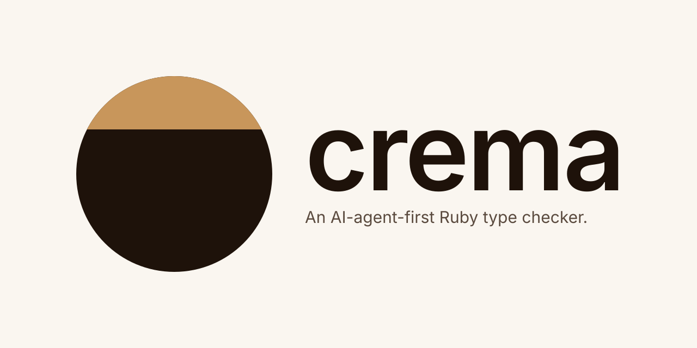

<p align="center">
  
</p>

# crema

> Please check the crema, and then stir three times before you taste.

**Crema** is an AI-agent-first **Ruby** type checker powered by **RBS**, written in Rust.

- **AI-agent first** — Designed for AI coding agents as the primary user. CLI-first, every diagnostic is one JSON object on one line.
- **Ultra-fast** — High-speed type checking via a full Rust implementation.
- **Inline RBS by default** — Type-check `.rb` files using `# @rbs` or `#:` annotations alone. No separate `sig/` file required.
- **UNIX-composable** — No flags for filtering, limiting, or formatting output. Pipe to `head`, `grep`, `jq` instead.

## Usage

crema emits one JSON object per diagnostic, one per line (JSONL). This makes it trivial to compose with standard UNIX tools.

Write the type inline in your `.rb` file — crema reads `# @rbs` and `#:` annotations by default, no flag and no separate `sig/` file required:

```ruby
class Calculator
  #: (Integer, Integer) -> Integer
  def add(a, b)
    a + b
  end

  class Builder
  end

  def build
    Buildor.new # typo
  end
end

Calculator.new.add("hello", "world")
```

Add a `crema.toml` next to it declaring the type-check scope — `crema check` requires this (see Configuration below):

```toml
# crema.toml
check = ["."]
```

Running `crema check app.rb` outputs:

```
{"code":"Ruby::UnknownConstant","end_byte":131,"file":"app.rb","fingerprint":"0fc3c04b39d422e9","line":11,"message":"Cannot find the declaration of constant: `Buildor`","name":"Buildor","path":"Buildor","searched_namespaces":["::Calculator"],"severity":"error","start_byte":124}
{"actual":"\"hello\"","code":"Ruby::ArgumentTypeMismatch","defined_in":"::Calculator","end_byte":180,"expected":"::Integer","file":"app.rb","fingerprint":"0fa009fd5ccd4aa6","line":15,"message":"Cannot pass `\"hello\"` as argument 1 of `add`, expected `::Integer`","method_name":"add","severity":"error","start_byte":173}
{"actual":"\"world\"","code":"Ruby::ArgumentTypeMismatch","defined_in":"::Calculator","end_byte":189,"expected":"::Integer","file":"app.rb","fingerprint":"76b4d6a993072eda","line":15,"message":"Cannot pass `\"world\"` as argument 2 of `add`, expected `::Integer`","method_name":"add","severity":"error","start_byte":182}
```

The doc-style `# @rbs (Integer, Integer) -> Integer` works equivalently; pick whichever fits your comment conventions. See [rbs's inline annotation spec](https://github.com/ruby/rbs/blob/master/docs/inline.md) for the full grammar.

If you prefer to keep type definitions in a separate `sig/` file (e.g. for `.rbs`-only libraries or vendored gems), add `sig = ["sig"]` to `crema.toml` — crema does not read `./sig/` on its own:

```rbs
# sig/calculator.rbs
class Calculator
  def add: (Integer, Integer) -> Integer
end
```

Because the output is JSONL, common needs are one pipe away:

```sh
# Type check files
crema check app.rb lib/foo.rb

# Cap the number of diagnostics
crema check app.rb | head -n 5

# Filter by diagnostic code
crema check app.rb | grep Ruby::ArgumentTypeMismatch

# Pretty-print with jq
crema check app.rb | jq .

# Group errors by code, sorted by frequency
crema check app.rb | jq -r .code | sort | uniq -c | sort -rn

# Show only file:line:message for a human-readable summary
crema check app.rb | jq -r '"\(.file):\(.line): \(.message)"'
```

### Baseline workflow (`--tamp`)

The output format is tamped (stably projected).
The keys for each record are reduced to only `file`, `code`, and `fingerprint`, and are sorted in this order.
This output is ideal for use as a baseline.

Commit the output as a baseline and let `git diff` gate the increment:

```sh
# 1) Generate the baseline (once, and after every intentional cleanup)
crema check --tamp > .crema-baseline.jsonl

# 2) Inspect what has changed since the baseline
#    `+` lines are new diagnostics (regressions), `-` lines are ones you
#    have fixed. Byte-lex sort makes matching rows collide on the same
#    diff hunk.
git diff -- .crema-baseline.jsonl

# 3) Pick the next batch of debts to burn down with jq
git diff -- .crema-baseline.jsonl \
  | grep '^-{' | sed 's/^-//' \
  | jq -r 'select(.code == "Ruby::NoMethod") | .file' \
  | sort -u

# 4) Gate CI on "no new regressions" — an added row (`^+{`) fails.
#    Capture the generator's exit code separately: `crema` exits `1`
#    when diagnostics are present (expected in this workflow) and `2`
#    on a hard error (missing config, build failure). We accept 0/1 as
#    "generated successfully" and treat anything else as a crash — a
#    crash would produce an empty file, which would look like "all
#    debt cleared" to the diff gate below.
crema check --tamp > .crema-baseline.jsonl.new
code=$?
if [ $code -ne 0 ] && [ $code -ne 1 ]; then
  echo "crema check --tamp failed (exit $code); refusing to compare." >&2
  exit $code
fi
if diff -u .crema-baseline.jsonl .crema-baseline.jsonl.new \
     | grep -q '^+{'; then
  echo "New diagnostics introduced. Fix them or refresh the baseline." >&2
  exit 1
fi
```

Notes:

- Exit code is unchanged (`0` clean, `1` errors present, `2` hard
  error). In `--tamp` mode diagnostics are buffered until the run
  completes, so a mid-run crash produces an **empty** file — always
  check the exit code (as the snippet above does) rather than trusting
  the file's content alone; a naive `crema check --tamp > out || true`
  wrapper would let a crash silently look like "zero regressions".
- The diagnostic **set** is the same as normal mode — `[diagnostic]`
  severity overrides (including `"Ruby::Foo" = "ignore"`) apply before
  projection. Silencing a code removes it from the baseline too.
- The key order (`file` → `code` → `fingerprint`) is chosen so that
  `LC_ALL=C sort` on the output is a no-op — external tools that need
  to re-sort a merged baseline preserve the same ordering, even when
  a filename contains bytes that JSON escapes.

### CLI options

| Option | Description |
|--------|-------------|
| `-e <EVAL>` | Check an inline Ruby snippet against the project's type-check scope (from `crema.toml`'s `check` field) without adding the snippet to that scope. Still requires a configured `check` field. Mutually exclusive with file arguments. |
| `--sig <DIR>` | RBS directory to load (repeatable). **Replaces** any `sig` list in `crema.toml`. See `--add-sig` to append instead. |
| `--add-sig <DIR>` | Extra RBS directory to load (repeatable). Appended to the `sig` list in `crema.toml`. Ignored (with a warning) when `--sig` is also given. |
| `--inline <true\|false>` | Whether to read `# @rbs` / `#:` inline annotations from `.rb` files. Default: `true`. Set to `false` to use only `sig/` as the source of truth. |
| `--config <PATH>` | Top-level flag: load a config file from `<PATH>` instead of auto-discovering `./crema.toml`. The filename is arbitrary. When set, cwd discovery is **bypassed** (no merge). Missing or malformed files exit `2`. |
| `--no-bundler` | Top-level flag: resolve gem paths with plain `ruby` instead of `bundle exec ruby`, even when a `Gemfile` is present. Lets `crema extract` run in CI without `bundle install`; gem-provided types (anything beyond rbs core and globally installed gems) are then **not** resolved. Snapshots built with and without the flag are cached separately. |

Positional `<path>` arguments (`crema check app.rb lib/foo.rb`) no longer expand the type-check scope — they **filter** the diagnostics down to files within the scope declared by `crema.toml`'s `check` field. A file argument must already be inside that scope (exit `2` otherwise); a directory argument is expanded recursively and intersected with the scope. Bare `crema check` (no positional arguments) reports every file in scope.

### Configuration (`crema.toml`)

For settings you want to persist across runs, drop a `crema.toml` next to where you invoke `crema` (crema also walks up toward the repository boundary looking for one). `crema check` requires a `check` field declaring its type-check scope: a missing `crema.toml`, or one without a `check` field, exits `2` with a copy-pasteable suggestion. Other subcommands (e.g. `crema doc diagnostic`) still run with sensible defaults when no config file is found.

To load a config from a different path (e.g. switching between project profiles or pointing tests at a fixture), pass `--config <PATH>` as a top-level flag:

```
crema --config configs/strict.toml check app.rb
crema --config /abs/path/profile.toml doc diagnostic
```

`--config` short-circuits cwd discovery: the named file is loaded verbatim and `./crema.toml` is not consulted. Relative paths inside the file (e.g. `sig = ["vendor/rbs"]`) are resolved from the **current working directory**, not from the directory of the config file — so a config file is portable across cwds only when its inner paths are absolute.

```toml
# crema.toml

# Type-check scope (required): directories (recursed for .rb files) and/or
# individual .rb files, resolved relative to this file's directory. CLI
# positional arguments filter this scope down to a subset; they no longer
# add to it.
check = ["app", "lib"]

# RBS directories to load. Nothing is loaded implicitly, not even ./sig/. The
# CLI `--sig` flag replaces this list wholesale (spec Design Goal 4,
# CLI overrides config); use `--add-sig` for the "config plus extras"
# workflow instead.
sig = ["vendor/rbs", "private/sig"]

# Read # @rbs / #: inline annotations from .rb files. Default: true.
# A CLI --inline flag, if present, overrides this.
inline = true

# stdlib libraries bundled with the rbs gem, loaded by name. Each entry
# pulls in ${rbs_gem}/stdlib/<name>/, and its manifest dependencies are
# resolved transitively (e.g. "logger" also loads "monitor"). A name with
# no matching stdlib directory is reported on stderr and skipped.
libraries = ["json", "logger"]

[diagnostic]
# Base severity table. One of:
#   "default"   — the Steep-parity table baked into crema (default)
#   "all_error" — promote every diagnostic to error
#   "all_ignore" — demote every diagnostic to ignore; combine with per-code
#                  overrides below to build "only the codes I name"
preset = "default"

# Per-code overrides win over the preset.
# Severities: "error", "warning", "information", "hint", "ignore"
# ("ignore" drops the diagnostic before it is written.)
"Ruby::NoMethod" = "warning"
"Ruby::ArgumentTypeMismatch" = "error"
```

Unknown diagnostic codes in `[diagnostic]` are reported on stderr as warnings, not fatal errors — a typo or a code that was renamed in a newer crema release will not break the run.

To discover which codes you can put in `[diagnostic]`, ask crema itself:

```bash
# Every diagnostic code crema can emit, with its current severity
# (the [diagnostic] config above is applied), one JSON object per line.
crema doc diagnostic

# {"code":"Ruby::NoMethod","severity":"warning"}
# {"code":"Ruby::ArgumentTypeMismatch","severity":"error"}
# ...

# Just the code names
crema doc diagnostic | jq -r .code

# Only codes currently reported as errors
crema doc diagnostic | jq -r 'select(.severity == "error") | .code'

# Detailed markdown for one diagnostic code, including typical fixes
crema doc diagnostic Ruby::NoMethod
```

### RBS loading order

1. **Auto-detect + cache**: Detects the `rbs` gem and loads `core/` from it. The detected path is cached in `.crema/cache/rbs_gem_dir` so subsequent runs skip the Ruby subprocess.
2. **`libraries`**: stdlib libraries named in `crema.toml` are loaded from the detected rbs gem's `stdlib/`, with manifest dependencies resolved transitively.
3. **`sig/` directory**: Always loads `.rbs` files from `./sig/` in the current working directory, if it exists.
4. **`--sig <DIR>`**: **Replaces** the `sig` list from `crema.toml` (spec Design Goal 4, CLI overrides config). The auto-discovered `./sig/` from step 3 is still loaded independently.
5. **`--add-sig <DIR>`**: Appended to the `crema.toml` `sig` list. Ignored (with a warning) when `--sig` is also passed on the same invocation.

## Installation

### Prebuilt binaries

The GitHub Release ships prebuilt archives built on Amazon Linux 2023, one
for `x86_64` and one for `aarch64`. They run on any Linux of the matching
architecture with glibc 2.34 or newer. On macOS, build from source instead
(see below).

Download the archive for your architecture, verify its checksum, then
install the `crema` binary somewhere on your `PATH`.

```sh
version=v0.2.0
target="amazonlinux-2023-$(uname -m)"

curl -LO "https://github.com/ksss/crema/releases/download/${version}/crema-${version}-${target}.tar.gz"
curl -LO "https://github.com/ksss/crema/releases/download/${version}/checksums.txt"

sha256sum -c --ignore-missing checksums.txt

tar -xzf "crema-${version}-${target}.tar.gz"
install -m 0755 crema ~/.local/bin/crema
```

The archive also contains `LICENSE` and `THIRD_PARTY_LICENSES` (license texts
and copyright notices of every crate linked into the binary).

`crema` does not install the `rbs` gem. It uses the `rbs` gem available in the
Ruby/Bundler environment of the checked project.

### From source

```sh
cargo install --path .
```

### Requirements

- Rust toolchain (edition 2024)
- `rbs` gem installed (for core/stdlib type definitions auto-detection)

## Agent skills

`skills/` holds [Agent Skills](https://agentskills.io) that teach a coding
agent a crema workflow. They are versioned with the binary because they
read its JSONL output, so replace `vX.Y.Z` below with the tag of the binary
you installed.

- `rbs-from-diagnostics` — turn `crema check` output into
  `sig/gem-patch/<gem>/*.rbs` for gems that ship no RBS, one gem per
  cycle, ranked by how many NoMethod diagnostics cascade from each
  unresolved constant. See `skills/rbs-from-diagnostics/SKILL.md`.

Install with the GitHub CLI (preferred; `gh skill` is in preview):

```sh
gh skill install ksss/crema rbs-from-diagnostics@vX.Y.Z --agent claude-code
```

or with the `skills` CLI:

```sh
npx skills add ksss/crema --skill rbs-from-diagnostics
```

or copy the directory into your agent's skill location by hand, for
example `.claude/skills/rbs-from-diagnostics/` for Claude Code:

```sh
git clone --depth 1 --branch vX.Y.Z https://github.com/ksss/crema.git /tmp/crema
cp -r /tmp/crema/skills/rbs-from-diagnostics .claude/skills/
```

## Development

```sh
# Run tests
cargo test

# Build release binary
cargo build --release

# Run directly
cargo run -- check app.rb
```

## Acknowledgements

crema stands on the shoulders of two prior projects in the Ruby type ecosystem:

- **[rbs](https://github.com/ruby/rbs)** (BSD-2-Clause / Ruby) — crema is a Rust port of rbs's Ruby implementation. The type system semantics, RBS parser data structures, and many of the algorithms in this codebase are direct translations of rbs's Ruby code. The struct, field, and enum names in crema deliberately mirror rbs to make the lineage readable from the source.
- **[Steep](https://github.com/soutaro/steep)** (MIT) — crema's type-checker architecture (bidirectional checking, constraint solving, method dispatch) is heavily inspired by Steep. When in doubt about how a Ruby/RBS construct should be type-checked, the answer often comes from reading Steep.

crema also depends on:

- **[ruby-prism](https://github.com/ruby/prism)** for Ruby source parsing.
- **[ruby-rbs-sys](https://github.com/ruby/rbs/tree/master/rust/ruby-rbs-sys)** — Rust FFI bindings to the RBS C parser. crema bundles a vendored copy at [`vendor/ruby-rbs-sys/`](vendor/ruby-rbs-sys) because it depends on newer RBS C bindings than the published `ruby-rbs-sys 0.3.0` exposes. The vendored sub-crate is distributed under its upstream BSD-2-Clause / Ruby License terms; the full license texts are included at [`vendor/ruby-rbs-sys/BSDL`](vendor/ruby-rbs-sys/BSDL) and [`vendor/ruby-rbs-sys/COPYING`](vendor/ruby-rbs-sys/COPYING) per the BSD-2-Clause requirement to retain copyright notices. The prebuilt binary archive carries these and every other linked crate's notice in `THIRD_PARTY_LICENSES`.

This project would not exist without the maintainers and contributors of rbs, Steep, and Prism.

## License

MIT — see [LICENSE](LICENSE).
